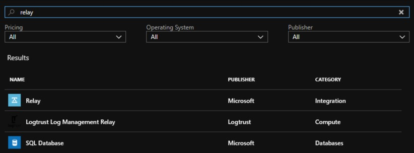
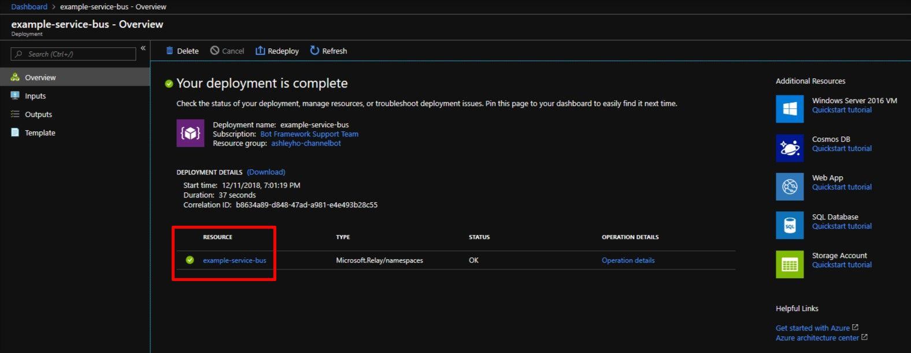
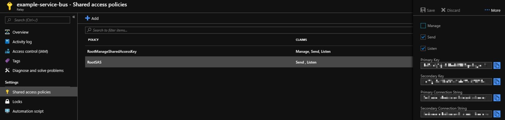
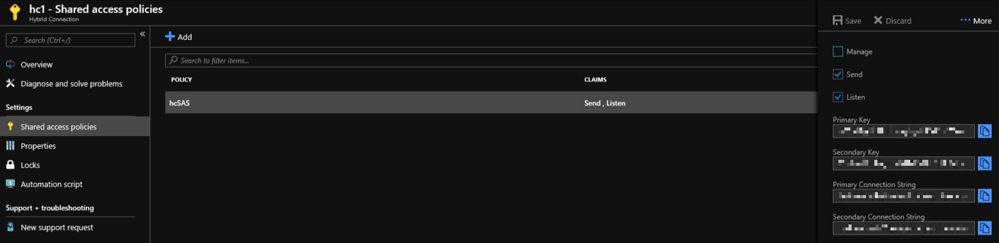
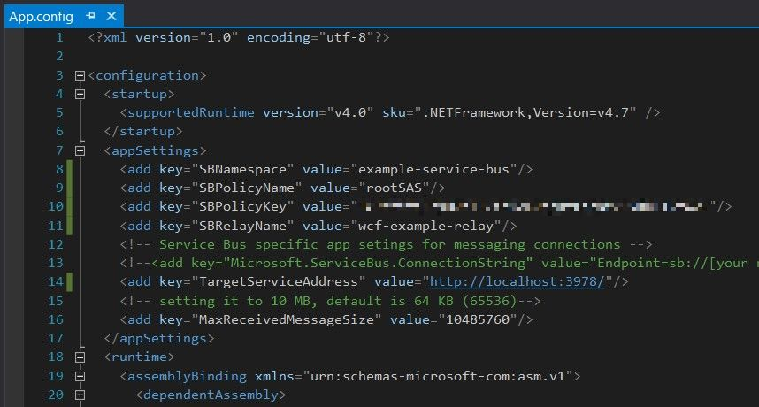
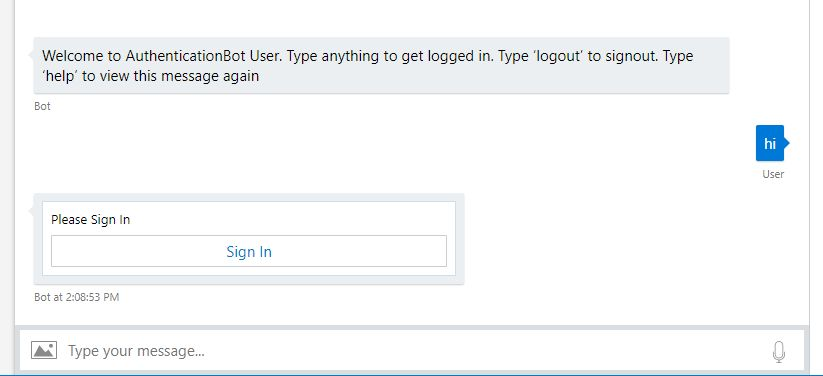
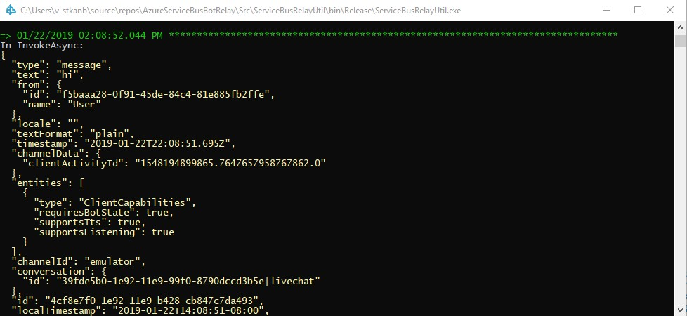
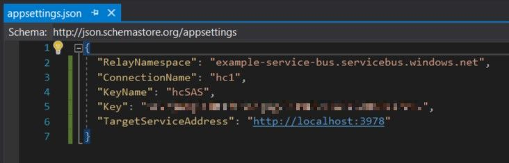
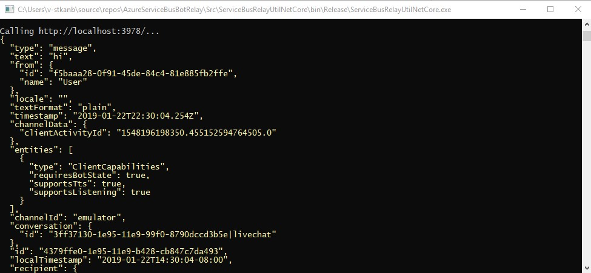

# Routing Your Locally Hosted Bot Using Azure Service Bus Relays
##### by Steven Kanberg 
December 12, 2018

This blog explains how to set up an Azure Service Bus Relay resource, create the necessary relays in Visual Studio, and connect your locally hosted bot for testing across the various channels available in the Bot Framework ecosystem.

## Prerequisites:

- An Azure account (create a new account [here](https://azure.microsoft.com/en-us/free/))
- Access to Visual Studio
  - .Net Framework 4.7 or .Net Core 2.1 (project dependent)
- Access to VS Code
  - dotnet (.Net Core CLI - read about and install from [here](https://docs.microsoft.com/en-us/dotnet/core/tools/?tabs=netcore2x))
- A bot developed using one of the Bot Framework v4 SDKs (create your first bot [here](https://docs.microsoft.com/en-us/azure/bot-service/?view=azure-bot-service-4.0))

## Azure Service Bus

[Azure Service Bus Relays](https://docs.microsoft.com/en-us/azure/service-bus-relay/) have several features that make it an excellent option and alternative to ngrok:
- Locally debug bot channel performance without your data needing to pass international boundaries.
- Facilitates secure connectivity between on-premise and cloud environments.
- Works without changes to corporate firewalls and network infrastructure.
- The resource owner manages and controls the environment.
- It allows for multiple application connections.

To get started, follow these steps:

1. Navigate to the [Azure portal](https://portal.azure.com/) and log in.

2. Select the **Create a resource** option in the sidebar menu.

3. Search for **Relay** in the search field and select this option from the list once displayed.
   

4. Click **Create** to begin building your service bus relay resource.

5. Complete each field (Name, Subscription, Resource group, Location) to create the relay namespace.

6. Click **Create** to finalize the creation process.

7. Once completed, an overview of the deployment is shown. Click the resource name you just created, under **Resource**.

8. Select the **Shared access policies** blade located under **Settings**.

9.  Click the **+ Add** button to create a new policy. Enter a **Policy name** and check both **Send** and **Listen**. For security reasons, be sure to leave **Manage** unchecked.

10. Copy the policy name down and Click **Create**.

11. Once the new policy has been created, select it and copy down the **Primary Key**.

12. (Optional) If you plan on compiling the .Net Core version of the project, a Hybrid Connection will need to be created manually.
    
    a. Select **Hybrid Connections** to open the blade.

    b. Click **+ Hybrid Connection**. Enter a **Name** and leave all other values empty. If **Requires Client Authentication** is checked, clear the checkbox as client authentication is not required.

    c. Copy the name down and click **Create**.

    d. Once the hybrid connection has been created, select it. This will open the respective blade.

    e. Select the **Shared access policies** blade located under **Settings**.

    f. Click the **+ Add** button to create a new policy. Enter a **Policy name** and check both **Send** and **Listen**. For security reasons, be sure to leave **Manage** unchecked.

    g. Copy the policy name down and click **Create**.

    h. Once the new policy has been created, select it and copy down the **Primary Key**.

13. Return to the Azure portal dashboard.

## Azure Bot Service

An Azure Web Bot is required for routing between your locally hosted bot and the service bus. You can use a bot you have already created or follow these instructions on how to [Create a bot with Azure Bot Service](https://docs.microsoft.com/en-us/azure/bot-service/bot-service-quickstart?view=azure-bot-service-4.0) to get started.

## Azure Service Bus Bot Relay

The Azure Service Bus Bot Relay is a GitHub project that can be compiled in either Visual Studio or VS Code and run locally to monitor your localhost address. It serves as the connection between your locally hosted bot and the service bus routing through your Azure Web Bot.

It functions like ngrok’s tunneling service by constructing a secure messaging service on Azure from which the bot can route through. In this way, you can debug your locally hosted bot on different channels.

This solution offers two options for compiling: .Net Framework and .Net Core. Using either will provide the same connectivity, however, note that:

- Visual Studio can run and compile both .Net Framework and .Net Core.
- VS Code only supports running and compiling .Net Core projects via the dotnet command.
- .Net Framework programmatically creates a WCF relay when started. This relay is viewable online in your Azure Service Bus for the duration the relay is running locally.
- .Net Core requires manually creating the hybrid connection on Azure. Hybrid connections should not be shared by multiple users as the activity from each will conflict with each other. Instead, create a separate hybrid connection for each user.
- .Net Core provides cross-platform functionality and will run in both the Windows and Mac OS environments.

Before you can get started you will need a local copy of the solution. Navigate to the project’s GitHub [page](https://github.com/gabog/AzureServiceBusBotRelay) in a browser and clone the solution to your machine.

### Building with .Net Framework

1. Once the solution has been cloned to your machine, open the solution in Visual Studio.

2. In Solution Explorer, expand the **ServiceBusRelayUtil** folder.

3. Open the **App.config** file and replace the following values with those from your service bus (not the hybrid connection).
   
    a. "SBNamespace" is the name of your service bus created earlier. Enter the value in place of **[your namespace]**.
    
    b. "SBPolicyName" is the name of the shared access policy created in steps 9 through 11 during the service bus set up process. Enter the value in place of **"RootManageSharedAccessKey"**.
    
    c. "SBPolicyKey" is the value to the shared access policy created in steps 9 through 11 during the service bus set up process. Enter the value in place of **[your secret]**.
   
    d. "SBRelayName" is the WCF relay to be used. Remember, this relay is programmatically created and only exists on your machine. Create a new, unused name and enter the value in place of **[your relay name]**.
   
4. "TargetServiceAddress" sets the port to be used for localhost. The address and port number should match the address and port used by your bot. Enter a value in place of the "TODO" string part. For example, "http://localhost:3978".
   

   
5. Before testing the relay, your Azure Web Bot's messaging endpoint must be updated to match the relay.
   
    a. Login to the Azure portal and open your Web App Bot.
    
    d. Select **Settings** under Bot management to open the settings blade.
    
    e. In the **Messaging endpoint** field, enter the service bus namespace and relay. The relay should match the relay name entered in the **App.config** file and should not exist in Azure.
    
    f. Append **"/api/messages"** to the end to create the full endpoint to be used. For example, “https://example-service-bus.servicebus.windows.net/wcf-example-relay/api/messages".
    
    g. Click **Save** when completed.
   
6. In Visual Studio, press **F5** to run the project.
   
7. Open and run your locally hosted bot.
   
8. Test your bot on a channel (Test in Web Chat, Skype, Teams, etc.). User data is captured and logged as activity occurs.

    - When using the Bot Framework Emulator: The endpoint entered in Emulator must be the service bus endpoint saved in your Azure Web Bot **Settings** blade, under **Messaging Endpoint**.

9. Once testing is completed, you can compile the project into an executable.

    a. Right click the project folder in Visual Studio and select **Build**.

    b. The .exe will output to the **/bin/debug** folder, along with other necessary files, located in the project’s directory folder. All the files are necessary to run and should be included when moving the .exe to a new folder/location.
    - The **app.config** is in the same folder and can be edited as credentials change without needing to recompile the project.

### Building with .Net Core

1. Once the solution has been cloned to your machine, open the solution in Visual Studio.

2. In Solution Explorer, expand the **ServiceBusRelayUtilNetCore** folder.

3. Open the **appsettings.json** file and replace the following values with those from your service bus hybrid connection.
   
    a. "RelayNamespace" is the name of your service bus created earlier. Enter the value in place of **[your namespace]**.

    b. "ConnectionName" is the name of the hybrid connection created in step 12. Enter the value in place of **[your relay name]**.

    c. "KeyName" is the name of the shared access policy created in steps 9 through 11 during the service bus set up process. Enter the value in place of **"RootManageSharedAccessKey"**.

    d. "Key" is the value to the shared access policy created in steps 9 through 11 during the service bus set up process. Enter the value in place of **[your secret]**.
      
    e. "TargetServiceAddress" sets the port to be used for localhost. The address and port number should match the address and port used by your bot. Enter a value in place of the **[Your Bot URL and Port]**. For example, "http://localhost:3978".
   

   
4. Before testing the relay, your Azure Web App Bot's messaging endpoint must be updated to match the relay.
   
    a. Login to the Azure portal and open your Web App Bot.
    
    d. Select **Settings** under Bot management to open the settings blade.
    
    e. In the **Messaging endpoint** field, enter the service bus namespace and relay.
    
    f. Append **"/api/messages"** to the end to create the full endpoint to be used. For example, “https://example-service-bus.servicebus.windows.net/hc1/api/messages".
    
    g. Click **Save** when completed.
   
5. In Visual Studio, press **F5** to run the project.
   
6. Open and run your locally hosted bot.
   
7. Test your bot on a channel (Test in Web Chat, Skype, Teams, etc.). User data is captured and logged as activity occurs.

    - When using the Bot Framework Emulator: The endpoint entered in Emulator must be the service bus endpoint saved in your Azure Web Bot **Settings** blade, under **Messaging Endpoint**.

8. Once testing is completed, you can compile the project into an executable.

    a. Right click the project folder in Visual Studio and select **Publish**.

    b. For **Pick a publish Target**, select **Folder**.

    c. For **Folder or File Share**, choose an output location or keep the default.

    d. Click **Create Profile** to create a publish profile.

    e. Click **Configure...** to change the build configuration and change the following:

    - **Configuration** to "Debug | Any CPU"
    - **Deployment Mode** to "Self-contained"
    - **Target Runtime** to "win-x64"

    f. Click **Save** and then **Publish**

    g. The .exe will output to the **/bin/debug** folder, along with other necessary files, located in the project’s directory folder. All the files are necessary to run and should be included when moving the .exe to a new folder/location.
    - The **appsettings.json** is in the same folder and can be edited as credentials change without needing to recompile the project.